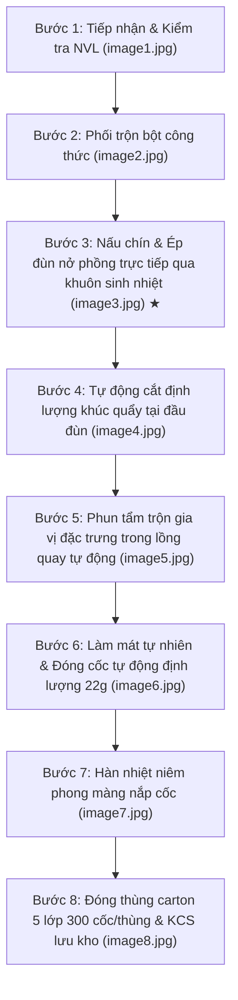

# BẢN THUYẾT MINH QUY TRÌNH CÔNG NGHỆ SẢN XUẤT VÀ TIÊU CHÍ XUẤT XỨ HÀNG HÓA
**Sản phẩm:** Snack Quẩy Giòn Giòn — **Mã HS:** `1905.90.90` — **Quy cách:** Cốc 22g (300 cốc/thùng)  
**Nhà máy sản xuất:** Cụm Công nghiệp Lương Sơn, Tỉnh Phú Thọ, Việt Nam  
*Phục vụ hồ sơ đề nghị cấp Giấy chứng nhận xuất xứ hàng hóa C/O Form D (Hiệp định ATIGA)*

---

**Kính gửi:** Phòng Quản lý Xuất Nhập khẩu khu vực Hà Nội (Bộ Công Thương Việt Nam)

Căn cứ Nghị định số 31/2018/NĐ-CP của Chính phủ quy định chi tiết Luật Quản lý ngoại thương về xuất xứ hàng hóa;  
Căn cứ Thông tư số 22/2016/TT-BCT và Thông tư số 19/2020/TT-BCT của Bộ Công Thương hướng dẫn quy tắc xuất xứ trong Hiệp định Thương mại Hàng hóa ASEAN (ATIGA - Form D);  
Công ty TNHH Đầu tư Thương mại Công nghiệp Thiên Long xin trân trọng thuyết minh chi tiết quy trình công nghệ 8 bước khép kín công nghệ **ÉP ĐÙN CHÍN NỞ GIÒN TRỰC TIẾP** (Extrusion Cooking & Direct Puffing — Hoàn toàn không qua công đoạn chiên ngập dầu) kèm hình ảnh minh họa máy móc đang vận hành thực tế tại Nhà máy Lương Sơn, Phú Thọ:

---

### I. NGUYÊN LIỆU ĐẦU VÀO VÀ TIÊU CHÍ CHUYỂN ĐỔI MÃ SỐ HÀNG HÓA (CTH)
1. **Nguyên liệu đầu vào chính:** Bột mì (HS 1101.00.19 - Chương 11), Dầu Olein cọ tinh luyện (HS 1511.90.36 - Chương 15), Đường (HS 1701.99.10 - Chương 17), cùng các gia vị thực phẩm có xuất xứ 100% nội địa Việt Nam.
2. **Thành phẩm tạo thành:** Snack Quẩy Giòn Giòn mang mã số HS `1905.90.90` (thuộc nhóm 19.05, Chương 19).
3. **Đánh giá tiêu chí xuất xứ:** Quá trình sản xuất đã làm thay đổi hoàn toàn mã số HS ở cấp độ 4 số từ Chương 11, 15, 17 sang Nhóm 19.05, đáp ứng hoàn hảo tiêu chí CTH (Change in Tariff Heading) của Hiệp định ATIGA.

---

### II. QUY TRÌNH CÔNG NGHỆ 8 BƯỚC KHÉP KÍN TẠI NHÀ MÁY PHÚ THỌ (CÔNG NGHỆ ÉP ĐÙN CHÍN NỞ GIÒN TRỰC TIẾP)

| STT | Công đoạn sản xuất | Mô tả công nghệ & Thông số kỹ thuật | Hình ảnh minh họa máy móc thực tế |
| :---: | :--- | :--- | :--- |
| **1** | Tiếp nhận & Kiểm tra NVL | Kiểm tra cảm quan, độ ẩm, an toàn thực phẩm của bột mì (25kg), dầu Olein cọ tinh luyện (6.6kg), đường, muối, bột nở, hương liệu trước khi nhập kho. | Kho nguyên liệu bột mì, bao bì cốc 22g và phụ gia thực phẩm |
| **2** | Phối trộn bột công thức | Định lượng bột mì, nước sạch (3kg), dầu cọ, đường, muối và phụ gia; đưa vào máy trộn bột công nghiệp đa trục nhào trộn đều đến khi khối bột mịn dẻo đồng nhất. | Máy trộn bột công nghiệp tự động công suất lớn |
| **3** | **Nấu chín & Ép đùn nở phồng trực tiếp** | Khối bột qua phễu nạp của máy ép đùn trục vít áp lực cao. Dưới tác động nhiệt ma sát và gia nhiệt tự động (>140°C - 160°C), tinh bột được nấu chín dẻo hoàn toàn. Khi hỗn hợp được nén đùn qua đầu khuôn ra môi trường không khí bên ngoài, áp suất giảm đột ngột làm hơi nước giãn nở bốc hơi chớp nhoáng (flash vaporization), khối bánh lập tức tự động nở phồng xốp và giòn rụm ngay tại cửa đùn khi tiếp xúc với không khí. **HOÀN TOÀN KHÔNG QUA BỒN CHIÊN DẦU NHÚNG NGẬP.** | Cụm máy ép đùn trục vít sinh nhiệt nở phồng trực tiếp |
| **4** | Tự động cắt định lượng | Dao cắt xoay tự động tốc độ cao lắp ngay tại mặt khuôn đùn cắt dải quẩy liên tục thành từng khúc quẩy đều đặn về chiều dài và hình dáng đặc trưng. | Cụm dao cắt xoay tự động phân đoạn phôi quẩy |
| **5** | Phun tẩm trộn gia vị đặc trưng | Snack quẩy giòn đưa vào lồng quay hình trống phun gia vị tự động. Hỗn hợp bột ớt, tiêu, hồi, quế, hương bò và gia vị được đảo đều bám chặt lên từng thanh quẩy. | Lồng quay phun gia vị tự động hình bát giác |
| **6** | Làm mát & Đóng cốc tự động 22g | Bánh làm mát tự nhiên trên băng chuyền inox sạch; hệ thống cân định lượng tự động đóng chính xác **22g/cốc** vào cốc nhựa chuyên dụng bảo đảm ATTP. | Băng chuyền định lượng và đóng cốc tự động |
| **7** | Hàn nhiệt niêm phong màng nắp cốc | Máy dán màng nắp cốc tự động niêm phong kín miệng cốc bằng màng in logo 'Snack Quẩy Giòn Giòn - KLT: 22g', giữ độ giòn tan của bánh tối thiểu 06 tháng. | Máy dán màng nắp cốc nhiệt tự động |
| **8** | Đóng thùng carton & KCS lưu kho | Đóng 30 cốc/bịch PE, xếp ngay ngắn 10 bịch = **300 cốc/thùng carton 5 lớp** (585x270x497mm, Net: 6.6kg, Gross: 8.8kg); dán băng keo niêm phong; KCS kiểm tra trọng lượng trước khi nhập kho xuất xưởng. | Đóng thùng carton 300 cốc/thùng & Thành phẩm xuất khẩu hoàn chỉnh |

---

### III. KẾT LUẬN VÀ CAM KẾT VỀ XUẤT XỨ HÀNG HÓA
Quy trình công nghệ 8 bước nêu trên được thực hiện hoàn toàn tại Nhà máy Lương Sơn, Tỉnh Phú Thọ với hệ thống dây chuyền máy móc công nghiệp khép kín, vượt xa các công đoạn gia công đơn giản theo quy định tại Điều 9 Thông tư số 22/2016/TT-BCT. Sản phẩm hoàn toàn đủ điều kiện xác nhận xuất xứ Việt Nam theo tiêu chí CTH để cấp Giấy chứng nhận xuất xứ hàng hóa C/O Form D.

*Phú Thọ, ngày 16 tháng 09 năm 2026*

| BỘ PHẬN KỸ THUẬT SẢN XUẤT | ĐẠI DIỆN NHÀ SẢN XUẤT |
| :---: | :---: |
| *(Ký, ghi rõ họ tên)* | *(Ký tên, đóng dấu mộc đỏ)* |
|    **Trưởng phòng Kỹ thuật** |    **ĐẶNG THỊ THU HƯƠNG** *Giám Đốc* |
